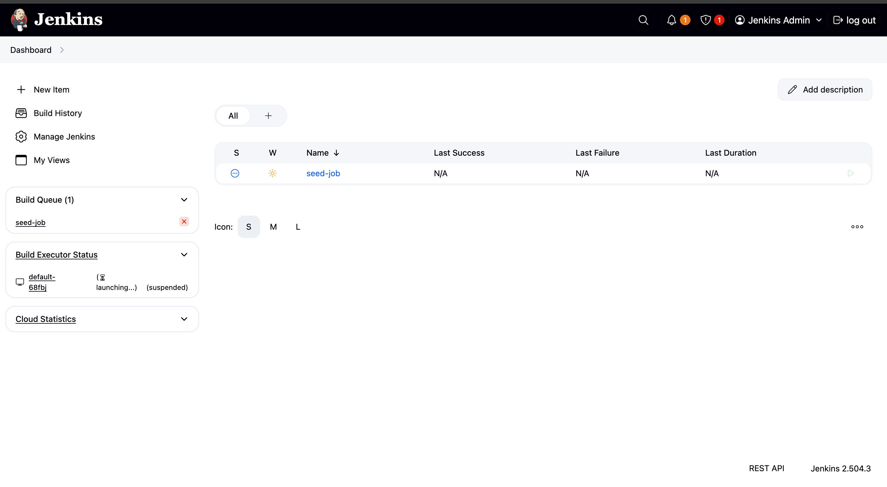
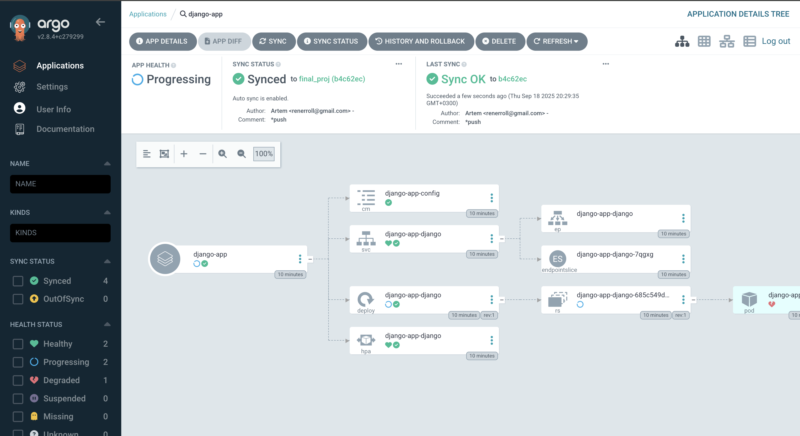
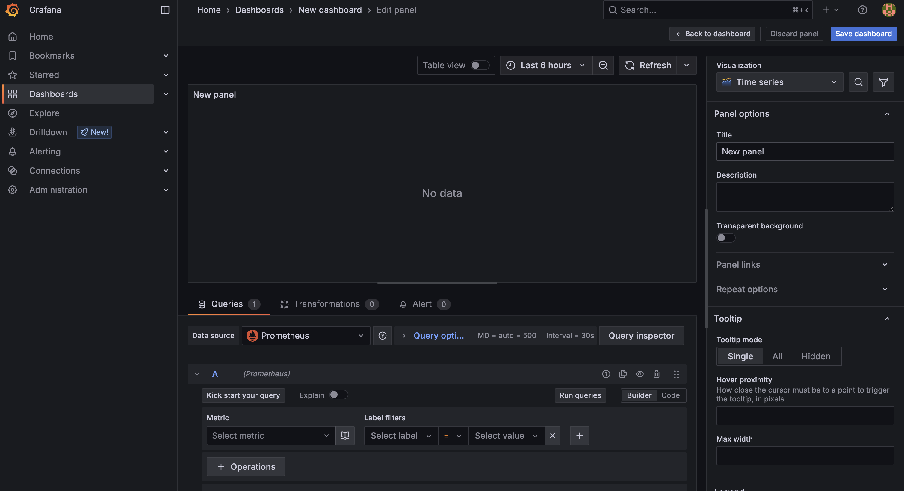
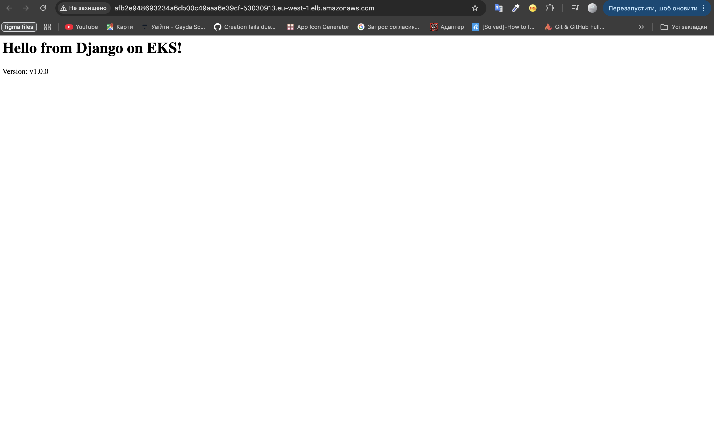

# DevOps Infrastructure Project

Complete DevOps infrastructure deployment using Terraform, Kubernetes (EKS), CI/CD pipelines, and monitoring stack.

## Project Architecture

This project deploys a full DevOps infrastructure on AWS with:
- **EKS Cluster** - Kubernetes cluster with worker nodes
- **VPC & Networking** - Secure network infrastructure
- **ECR Repository** - Docker image registry
- **CI/CD Pipeline** - Jenkins for automated deployments
- **GitOps** - ArgoCD for application management
- **Monitoring** - Prometheus & Grafana for metrics and alerting
- **Custom Django App** - Sample application deployment

## Project Structure

```
├── backend.tf             # S3 + DynamoDB backend configuration
├── main.tf                # Main Terraform configuration
├── variables.tf           # Input variables
├── outputs.tf             # Output values
├── terraform.tfvars       # Variable values
├── Jenkinsfile            # CI pipeline definition
├── assets/                # Screenshots and documentation
├── django/                # Django application source code
├── modules/               # Terraform modules
│ ├── s3-backend/          # Remote state backend
│ ├── vpc/                 # Network infrastructure
│ ├── ecr/                 # Docker image repository
│ ├── eks/                 # Kubernetes cluster
│ ├── monitoring/          # Prometheus and Grafana 
│ ├── jenkins/             # Jenkins deployment
│ └── argo_cd/             # ArgoCD GitOps
└── charts/                # Helm charts for applications
```

## Prerequisites

- AWS CLI configured with appropriate permissions
- Docker Desktop installed and running
- kubectl installed
- Helm installed
- Terraform installed

## Quick Start

### 1. Clone and Setup
```bash
git clone <repository-url>
cd devops
```

### 2. Configure AWS
```bash
aws configure
# Enter your AWS credentials
```

### 3. Create S3 Backend (First Time Only)
```bash
cd modules/s3-backend
terraform init
terraform apply
cd ../..
```

### 4. Deploy Infrastructure
```bash
terraform init
terraform plan
terraform apply
```

### 5. Configure kubectl
```bash
aws eks update-kubeconfig --region eu-west-1 --name eks-cluster-alx
```

## 🚀 Deployed Components

### Django Application
Build and deploy custom Django application:

```bash
# Navigate to Django app directory
cd django

# Build Docker image
docker build --platform linux/amd64 -t django-app .

# Tag for ECR
docker tag django-app:latest 111924087894.dkr.ecr.eu-west-1.amazonaws.com/ecr-alx:v1.0.3

# Push to ECR
docker push 111924087894.dkr.ecr.eu-west-1.amazonaws.com/ecr-alx:v1.0.3

# Deploy using kubectl
kubectl create deployment django-simple --image=111924087894.dkr.ecr.eu-west-1.amazonaws.com/ecr-alx:v1.0.3
kubectl expose deployment django-simple --type=LoadBalancer --port=80 --target-port=8000

# Access via port-forward for testing
kubectl port-forward deployment/django-simple 8000:8000
```

### Jenkins CI/CD
Access Jenkins dashboard:
```bash
kubectl get svc -n jenkins
# Open LoadBalancer EXTERNAL-IP in browser

# Get admin password
kubectl get secret jenkins -n jenkins -o jsonpath="{.data.jenkins-admin-password}" | base64 --decode && echo
# Username: admin
```

### ArgoCD GitOps
Access ArgoCD interface:
```bash
kubectl get svc -n argocd  
# Open LoadBalancer EXTERNAL-IP in browser

# Get admin password
kubectl -n argocd get secret argocd-initial-admin-secret -o jsonpath={.data.password} | base64 -d
# Username: admin
```

### Grafana Monitoring
Access Grafana dashboard:
```bash
kubectl get svc -n monitoring
# Open LoadBalancer EXTERNAL-IP in browser

# Get admin password
kubectl get secret --namespace monitoring kube-prometheus-stack-grafana -o jsonpath="{.data.admin-password}" | base64 --decode
# Username: admin
```

## 📸 Infrastructure Screenshots

Here are the screenshots of all deployed components in action:

### Jenkins CI/CD Pipeline

*Jenkins CI/CD dashboard with automated pipelines for Django application deployment*

### ArgoCD GitOps

*ArgoCD GitOps tool managing Kubernetes deployments with automatic synchronization*

### Grafana Monitoring Dashboard

*Grafana monitoring dashboard showing cluster metrics, resource usage, and application performance*

### Django Application

*Django application running successfully on Kubernetes cluster*

## 🔍 Monitoring and Debugging

### Check Cluster Status
```bash
kubectl get nodes
kubectl get pods --all-namespaces
kubectl get services --all-namespaces
```

### View Logs
```bash
kubectl logs -f deployment/django-simple
kubectl logs -f -n jenkins deployment/jenkins
kubectl logs -f -n argocd deployment/argocd-server
```

### Terraform Outputs
```bash
terraform output
```

## 🧹 Cleanup

### Remove Application
```bash
kubectl delete deployment django-simple
kubectl delete service django-simple
```

### Destroy Infrastructure
```bash
terraform destroy
```

### Clean Local Files
```bash
rm -rf .terraform .terraform.lock.hcl terraform.tfstate*
```

## 📋 Project Summary

This project demonstrates:
- ✅ **Infrastructure as Code** with Terraform
- ✅ **Container Orchestration** with EKS/Kubernetes  
- ✅ **CI/CD Pipeline** with Jenkins
- ✅ **GitOps Deployment** with ArgoCD
- ✅ **Monitoring Stack** with Prometheus/Grafana
- ✅ **Custom Application** deployment (Django)
- ✅ **AWS Integration** (ECR, EKS, VPC, S3)

Total resources deployed: ~40+ AWS resources including EKS cluster, VPC, ECR, Load Balancers, and monitoring stack.

---

**⚠️ Cost Warning**: This infrastructure includes multiple AWS resources (EKS nodes, Load Balancers, etc.). Remember to run `terraform destroy` when done to avoid charges.